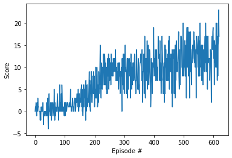
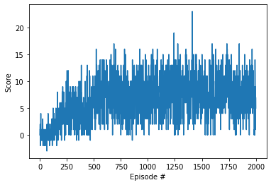
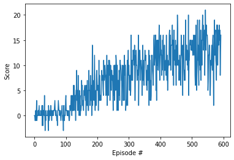
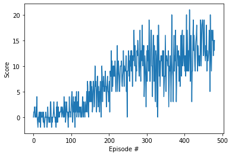
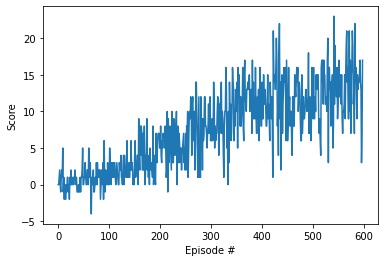

# Implementation

## Brief description of the algorithms implemented

The current implementation contains 3 algorithms implemented:

* [Dueling-DQN](https://arxiv.org/abs/1511.06581)
* [Double-DQN](https://arxiv.org/abs/1509.06461)
* [Prioritized Experience Replay](https://arxiv.org/abs/1511.05952)

The first two give a little improvement to make it converge faster. The third one doesn't improve the 
base Q-Network implementation in the number of episodes to converge as we'll see in the following sections.

## Neural Network implementations

### Neural Network architecture for Q-Network implementation

Basically the architecture is composed by 3 fully connected layers with 64 nodes per layer (except 
for the last one which have the same node as actions the agent could do in the environment), using 
ReLu activation function. Also, I use a dropout layer with P=0.4 for the basic Q-Network implementation.

Implementation [here](./src/models/qnetwork.py).

### Neural Network architecture for Dueling Q-Network implementation

I used the same arquitecture for the two networks needed for this implementation, the unique difference 
is that I didn't put any dropout over the architecture, which gives some interesting results because 
it converges in the same steps without it.

Implementation [here](./src/models/dueling_qnetwork.py).
Paper [here](https://arxiv.org/abs/1511.06581).

## Prioritized Experience Replay implementation

The current implementation ([source](./src/replay/prioritized_replay.py)) doesn't work as expected,
as you may see in the results section, this implementation never converges to the expected reward to
be considered solved. It's weird why it doesn't fully converge, maybe because the environment is not that
complex. I've tried with the parameter `alpha` to 0 to have the base experience replay implementation 
and it works as expected, but with the hyperparameters set (detailed below), it never converges.

Also to make the sampling faster, I've used the segment tree implementation recommended from the paper
to make the sampling algorithm faster. That implementation was taken from [here](https://github.com/openai/baselines/blob/master/baselines/common/segment_tree.py) 

## Double DQN implementation

This implementation was simple, it just changes the way that we compute the next state, instead of computing
the maximum output of the target neural network (or the one that we change with the soft-update), we use the same
maximum output (action) but the one from the local neural network (the one that keeps updating directly from the 
environment) but with the state-action value computed by the target NN.

Implementation could be found [here](./src/agents/dqn_agent.py#L146)

## Some results

### Base Q-Network

### Prioritized Experience Replay implementation

### Dueling DQN

### Double DQN

### Double DQN, Dueling DQN and experience replay (with uniform weights)

## Discussion

Definitely the one implementation that by itself provides a better convergence rate is the Double DQN with less than
a 500 episodes. The other ones are almost the same as the Q-Network base implementation for this environment. For more
complex states it could give better improvements so it would be nice to try the **Navigation by Pixels** environment
to have a more in depth conclusion.

The implementation of Prioritized Experience Replay is by far the more complex to implement because there are plenty of
details in the paper that you could miss if you try to implement it by yourself, maybe a basic implementation without any
segment tree in mind is easy but the training times get way off the uniform experience replay.

Using both Double-DQN and Dueling-DQN doesn't give any convergence improvement compared with the Q-Network base implementation,
but Double-DQN is far better that the ones described before. Maybe combining this two methods are not necesary better but adding 
the other methods described in rainbow allows this combination to work better.

## Final Training hyper parameters

All the hyperpameters used in the model could be found here:

* Agent trainer
    * number of episodes: 2000
    * maximum actions per episode: 1000
    * epsilon start: 1.0
    * epsilon end: 0.01 
    * epsilon decay: 0.995
    * gamma: 0.99
* Model hyperparameters
    * batch size: 64
    * learning rate: 0.0005
    * tau: 0.001 (soft update for the target parameters of the NN)
* Replay buffer
    * buffer size: 1000000
* Experience replay
    * Alpha 0.6 (priority factor for previous experiences)
    * Beta 0.4 (importance factor for sampling weights over previous experiences)
    * Epsilon: 0.00000000001 (to avoid 0 priority factor over previous experiences)

## Next steps

Basically there would be 3 next steps:

* Find out why the prioritized experience replay is not working given that the uniform variant works (alpha parameter with 0.0).
* Implement the whole rainbow framework to see how much improvement gives over the convergence rate of the model.
* Implement the CNN for the pixels environment to see if there is a big difference in the graphs reported here.